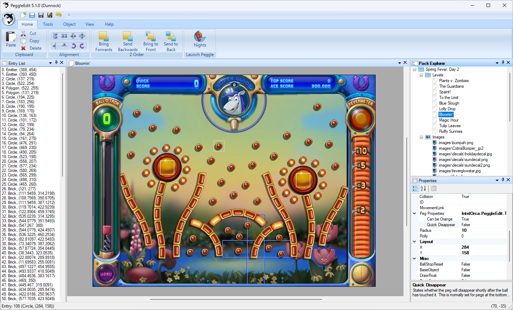

# PeggleEdit
A WYSIWYG level editor for Peggle Nights written in C# / WinForms.

## Documentation
Documentation can be found [here](https://github.com/IntelOrca/PeggleEdit/blob/master/docs/index.md).

## License
PeggleEdit is licensed under the  GPL-3.0 license.
